# 🔐 Secure Login Logger

A beginner-friendly backend security project developed using **Spring Boot**, **Spring Data JPA**, **H2 Database**, **BCrypt Password Hashing**, **REST APIs**, and **Docker**.

This application provides secure user registration and login functionality while recording every login attempt for auditing purposes.

---

# 📌 Project Overview

Secure Login Logger demonstrates how authentication systems work behind the scenes.

Instead of storing plain-text passwords, passwords are encrypted using BCrypt before being stored in the database. Every login attempt (successful or failed) is recorded with the user's email and [...]

---

# ✨ Features

- User Registration
- Secure Password Hashing using BCrypt
- User Login Authentication
- Login Attempt Logging
- H2 In-Memory Database
- RESTful APIs
- Docker Support
- Unit Testing with JUnit

---

# 🛠 Technologies Used

- Java 17
- Spring Boot
- Spring Data JPA
- H2 Database
- BCrypt
- REST API
- Maven
- Docker
- JUnit
- Postman
- Git & GitHub

---

# 📂 Project Structure

```
src
 ├── controller
 ├── entity
 ├── repository
 ├── service
 ├── config
 ├── resources
 └── test

postman
images
Dockerfile
README.md
```

---

# 🗄 Database

The project uses an **H2 In-Memory Database**.

Advantages:

- No installation required
- Fast startup
- Perfect for development and testing

Since the database exists only in memory, all data is cleared whenever the application stops.

Therefore, users must register again after restarting the application.

---

# 🔒 Security

Passwords are never stored in plain text.

Instead, BCrypt generates a unique hash before saving the password in the database.

Example:

```
Plain Password
↓

BCrypt Encoder
↓

Hashed Password
↓

Stored in Database
```

---

# 📝 Login Attempt Logging

Every login attempt is recorded.

Each log contains:

- Email
- Success / Failure
- Timestamp

This makes it possible to audit authentication attempts.

---

# 🌐 REST APIs

## Register User

POST

```
/register
```

Request

```json
{
  "email": "krithika@gmail.com",
  "password": "password123"
}
```

---

## Login

POST

```
/login
```

Request

```json
{
  "email": "krithika@gmail.com",
  "password": "password123"
}
```

---

## View Login Attempts

GET

```
/attempts/{email}
```

Example

```
/attempts/krithika@gmail.com
```

---

# 🧪 Testing

The project was tested using:

- Postman
- H2 Console
- JUnit Tests

The following scenarios were verified:

- Successful Registration
- Duplicate User Validation
- Successful Login
- Invalid Password
- Login Attempt Logging
- Password Hashing
- Docker Execution

---

# 🐳 Docker

Build Image

```bash
docker build -t secure-login-logger .
```

Run Container

```bash
docker run -p 8080:8080 secure-login-logger
```

---

# 📸 Screenshots

## 1. Creating Database Tables

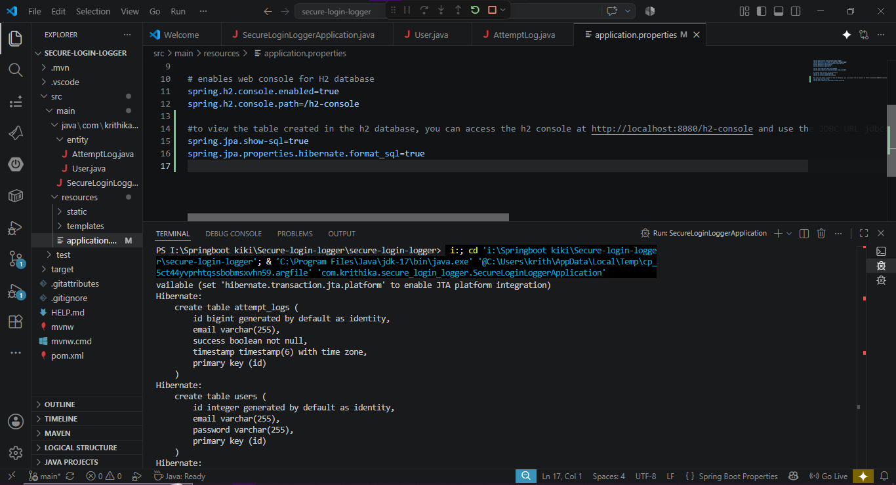

---

## 2. Register API Request

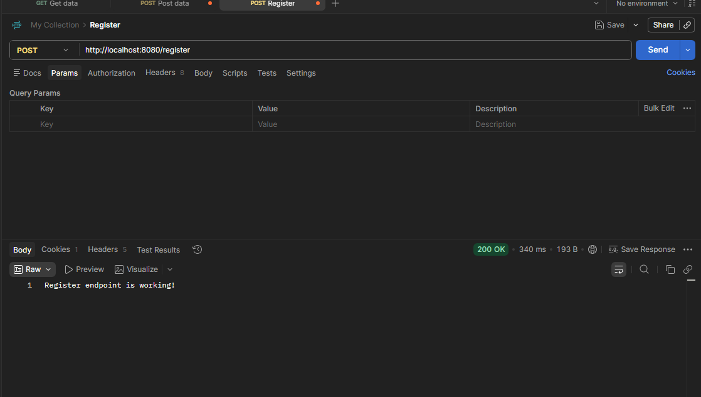

---

## 3. Registration Successful

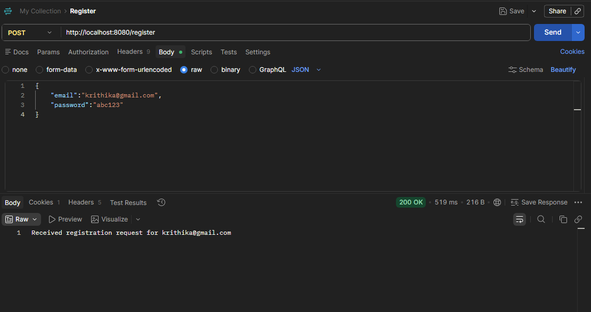

---

## 4. H2 Console Login

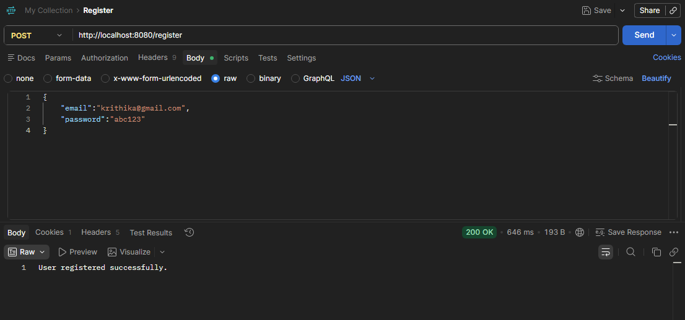

---

## 5. User Table Before BCrypt Hashing

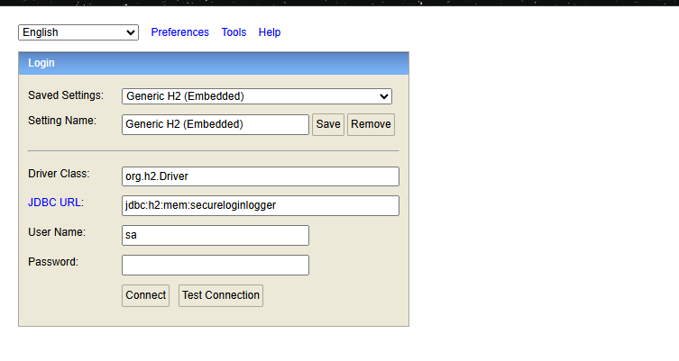

---

## 6. Password Stored as BCrypt Hash

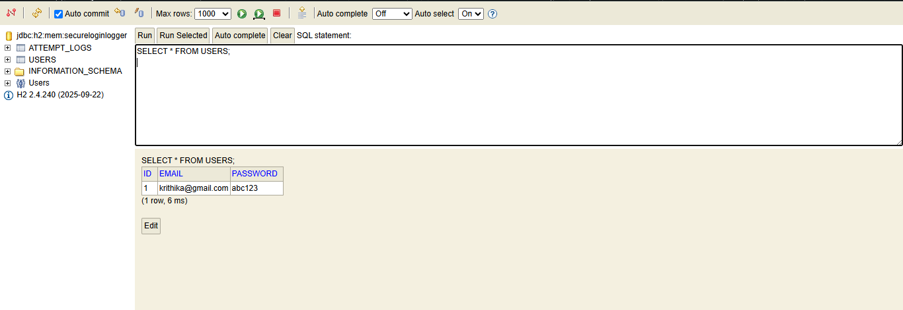

---

## 7. Invalid Login Attempt

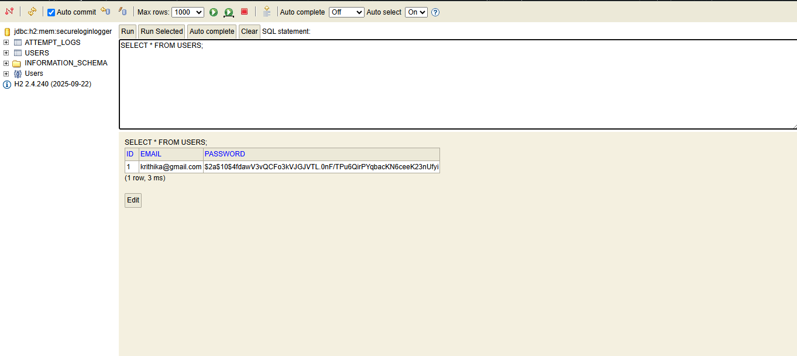

---

## 8. Attempt Logs in H2

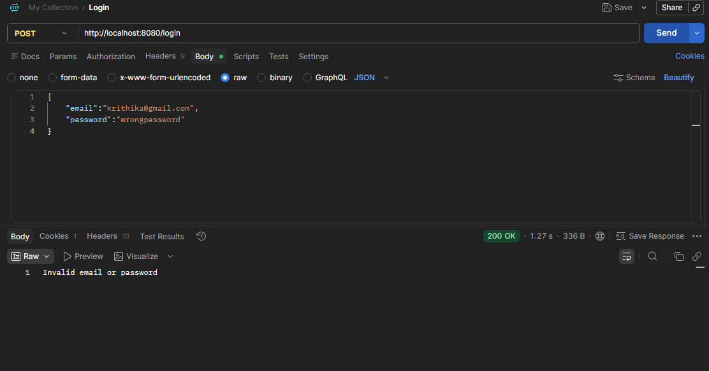

---

## 9. Attempt Logs using REST API

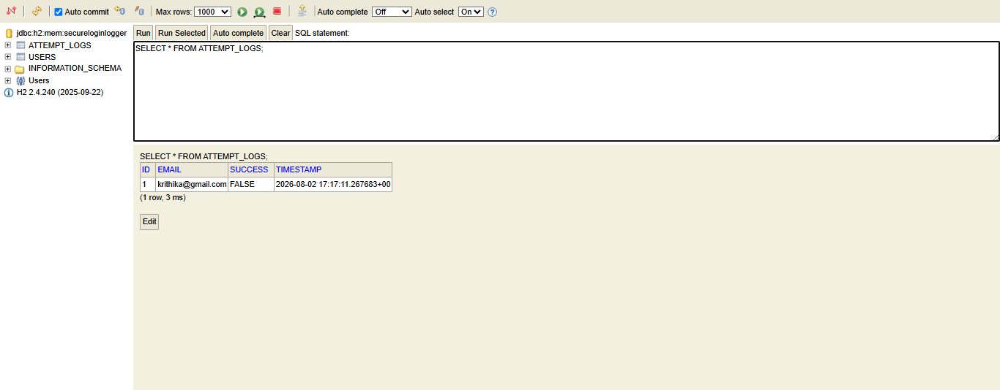

---

## 10. Multiple Login Attempts


---

## 11. JUnit Test Results

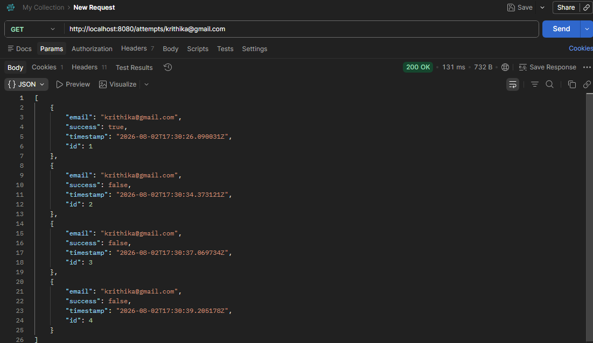

---

## 12. Docker Build

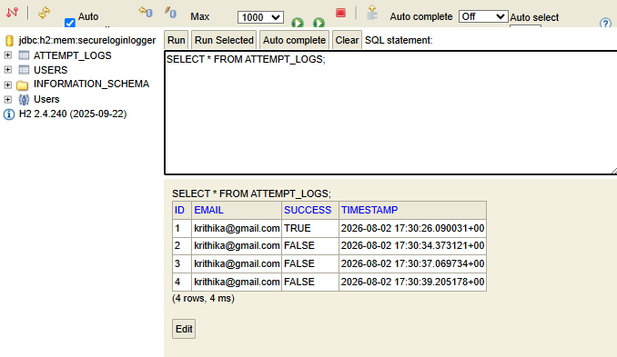

---

## 13. Docker Running Successfully

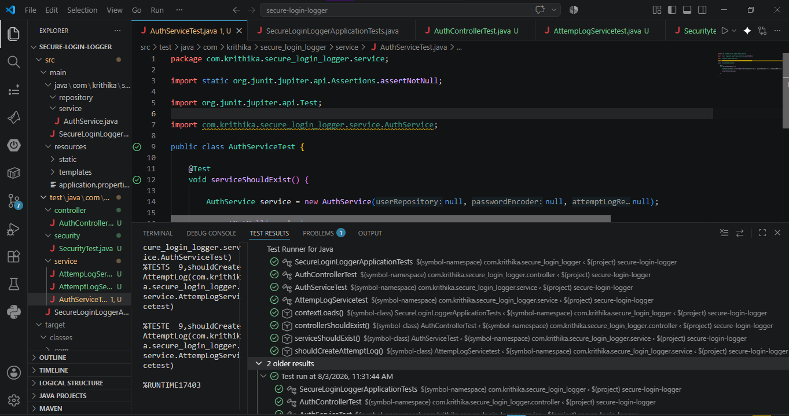

---

# 🚧 Challenges Faced

During development, several issues were encountered and resolved:

- JPA Repository Bean Injection Errors
- Constructor Injection Issues
- Missing No-Argument Constructors for Entities
- HTTP 401 Unauthorized Responses
- Spring Security Configuration Problems
- BCrypt Password Encoding
- H2 Console Configuration
- Maven Dependency Resolution
- Dockerfile Build Errors
- Docker Image Creation Issues

Each issue helped improve understanding of Spring Boot architecture and backend development.

---

# 🚀 Future Improvements

- JWT Authentication
- Role-Based Authorization
- PostgreSQL Integration
- Docker Compose
- Swagger/OpenAPI Documentation
- User Profile Management
- Email Verification
- Account Lock after Multiple Failed Logins
- CI/CD Pipeline using GitHub Actions

---

# 👩‍💻 Author

**Krithika Shree K**

Integrated M.Tech Software Engineering

VIT University

GitHub:
Author: krithikashree1957

This project was developed as a learning project to understand backend development, secure authentication, REST APIs, Spring Boot architecture, Docker containerization, and database interaction.
